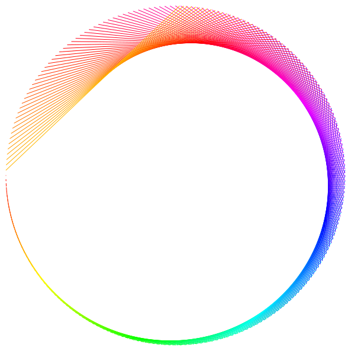
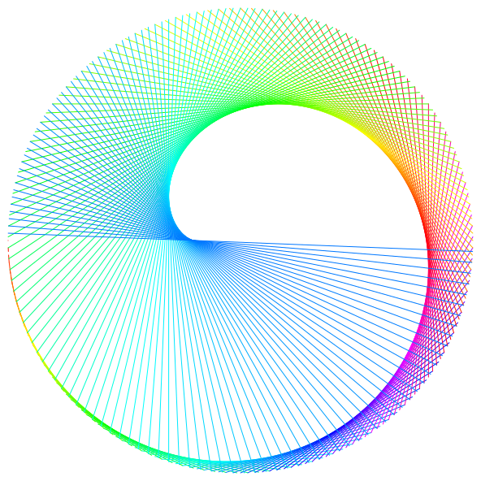
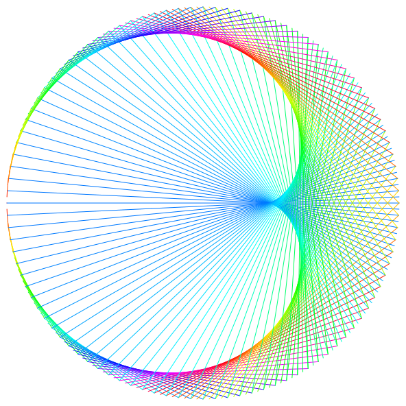
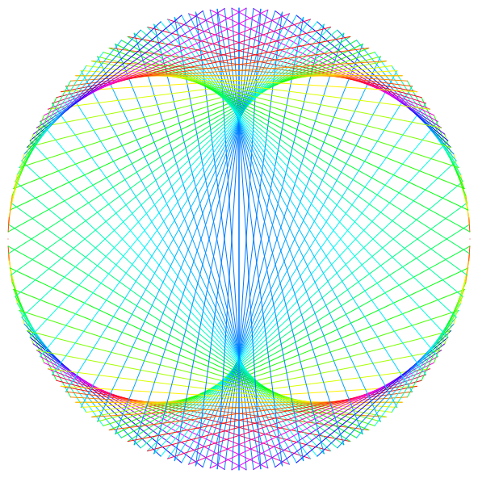
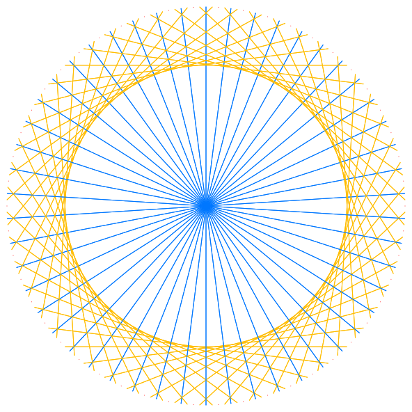
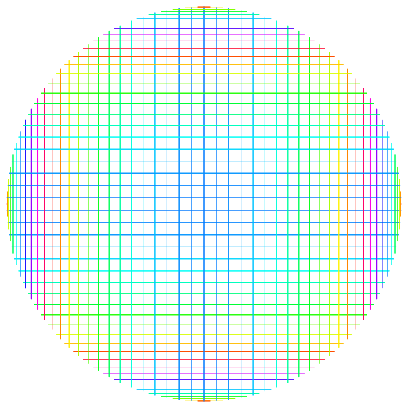

# Cardioid

A times tables modulo 200 visualisation rendered using [Snap.svg](https://github.com/adobe-webplatform/Snap.svg). This algorithm produces some pretty cool patterns and, because it's all just vectors, each frame can be exported individually.

0.75 | 1.5 | 2
--- | --- | ---
 |  | 

3 | 51 | 99
--- | --- | ---
 |  | 

It plays [a song](https://soundcloud.com/maxencecyrin/where-is-my-mind-the-pixies) if you're not on mobile, because art.
It was inspired by [a youtube video](https://www.youtube.com/watch?v=qhbuKbxJsk8).
